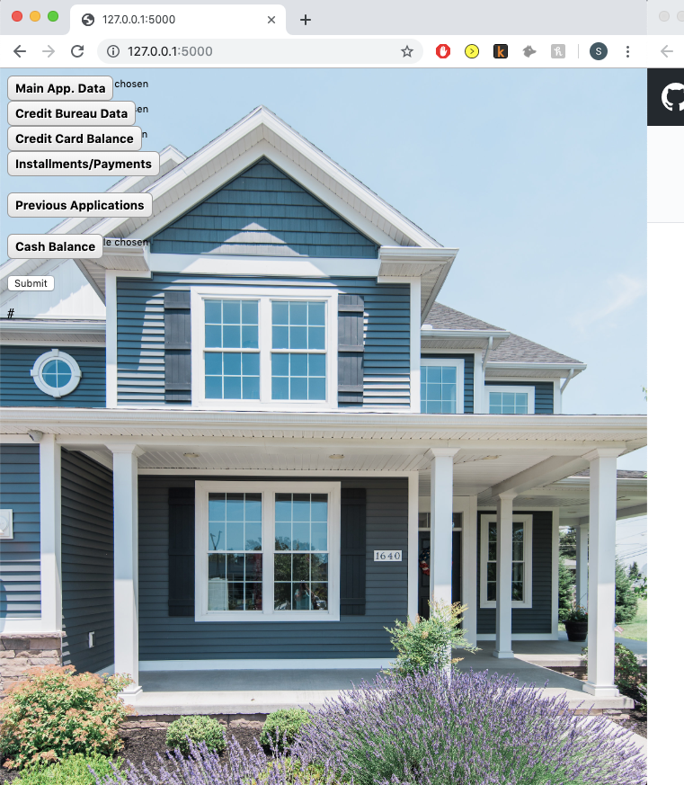

# Project 3 home credit classification

* Flask App Allows User to submit 6 csv's that are in the raw data format that the kaggle comp starts with
* The app will process/clean the files, run a model, and return predicitons in an html table
* Above the html table the user has the ability to download the predictions, associated application id's and decisions (reject or accept the loan) as a csv.

